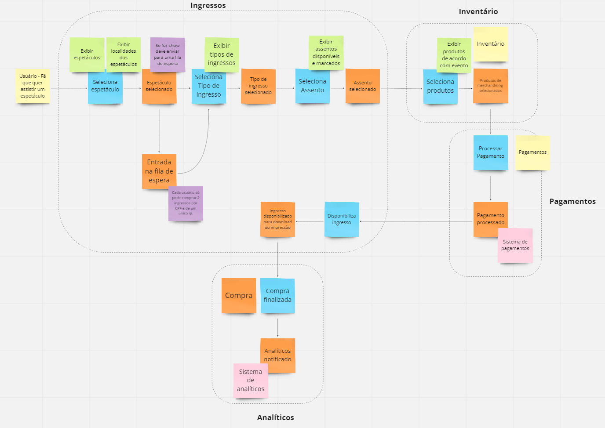

# Event Storming

Uma técnica bastante interessante que pode ser utilizada para enxergar as fronteiras 
entre domínios, subdomínios e bounded contexts é conhecida como [Event Storming](https://www.eventstorming.com/).

```
"O Event Storming é um workshop criado por Alberto Brandolini. Ele visa facilitar a visualização 
de subdomínios e bounded contexts, além de auxiliar no processo de estabelecimento da linguagem 
ubíqua."
``` 
Mais detalhes em: [O que é Event Storming?](https://www.treinaweb.com.br/blog/o-que-e-o-event-storming)

Apesar de ter como premissa um workshop incluindo todos os times envolvidos (stakeholders) no projeto com
objetivo de construir um diagrama visual que representa processos e eventos que podem acontecer com o domínio
do problema, como se trata de um projeto com o objetivo puramente didático, optou-se por utilizar esta 
ferramenta para fins de aprendizado.

Basicamente cada cor utilizada em um post-it tem um significado, alguns dos conceitos são: 
- `Domain events`(Laranja) - Os eventos são atividades que precisam acontecer dentro da nossa solução final; 
- `Commands` (Azul) - Ação que causa cada um dos eventos do domínio;
- `Actors`(Amarelo) - Um `Command` é uma ação causada por um `Actor`, ou seja uma interação com a aplicação;
- `Aggregates`(Amarelo Claro) -  Agrupamento de `Commands` e `Domain Events` em um bloco logico que segue um significado 
dentro do negócio;
- `Processes`(Roxo) - Fluxos de negócio que ocorrem por conta de um `Command` ou uma reação a um `Domain Event`;
- `External systems`(Rosa) - Provedor de serviços terceirizados;
- `Policies`(Roxo ou Vermelho claro) - Validações que são realizadas; 
- `Views` (Verde) - Visão com a qual um usuário interage para realizar uma tarefa ou pra receber um feedback de alguma 
ação.

------------


Abaixo é possível visualizar um diagrama contendo uma sessão de Event Storming para a 
aplicação exemplo que será desenvolvida nesse projeto. Esta é uma primeira versão e portanto
é possível que existam alterações futuras.




Inicialmente pela modelagem acima existem 4 possíveis serviços:
- Ingressos 
- Inventário (Produtos promocionais relacionados ao evento)
- Pagamentos
- Analíticos


Além disso notou-se a necessidade de outros serviços como:
- Auditoria
- Autenticação e Autorização