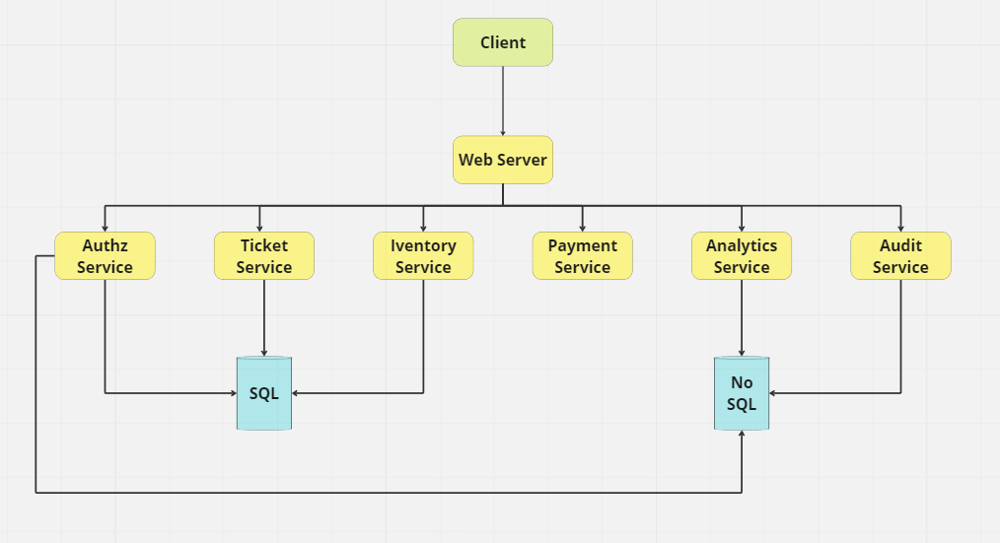

# System Design (Work In Progress)

Este tópico segue algumas das práticas encontradas neste repositório [System Design Primer](https://github.com/donnemartin/system-design-primer/tree/master).

Basicamente trata-se de compreender melhor os requisitos funcionais e não funcionais além de delimitar
quais soluções tecnológicas se ajustam adequadamente aos problemas e quais suas implicações, seus tradeoffs.

## 1. Outline use cases and constraints

### Casos de uso

Esta seção aborda alguns casos de uso fictícios e baseados na sessão de Event Storming. 
Aqui também são definidas funcionalidades e restrições.

---------

#### Usuário
- Usuário seleciona evento,espetáculo,show
- Usuário seleciona assento
- Usuário seleciona tipo de assento
- Usuário seleciona produtos promocionais relacionados ao evento

#### Sistema
- Sistema verifica se há vagas
- Sistema valida IP e identificador único por compra.
- Sistema gerencia fila virtual para grandes eventos como shows.
- Sistema deve disponibilizar ingresso para download e para impressão
- Sistema deve manter usuários
- Sistema deve manter eventos
- Sistema deve manter produtos
- Sistema deve processar pagamentos
- Sistema deve notificar usuário de compra
- Sistema deve permitir troca de ingressos entre usuários.
- Sistema deve garantir alta disponbilidade
- Sistema deve sugerir produtos promocionais de acordo com o evento
- Sistema deve ter um controle de acesso de usuários aos recursos
- Sistema deve manter um log de auditoria para utilização administrativa

### Analytics
- Sistema permite visualizar informações sobre produtos vendidos
- Sistema permite visualizar informações de uso da plataforma por clientes

### Constraints e suposições

---------

- Usuário só pode comprar 2 ingressos por sessão. 
- Sistema deve manter apenas uma única sessão por dispositivo e por usuário.
- Projeto deve incluir um mecanismo de teste para validar o trafégo.
- Sistema deve conseguir atender 500 solicitações de compra de ingresso por segundo incluindo o 
processamento do pagamento
- Sistema deve permitir que uma grande massa de dados referente aos dados de usuários sejam
armazenadas e visualizadas.

## 2. Criando um design de alto nível

Nesta seção são definidos aspectos de alto nível em um diagrama visual para servir como ponto de
partida. O objetivo é atender os requisitos funcionais e não funcionais e acordo com a seção anterior.

O diagrama acima é bastante simples e cria uma divisão entre os componentes acima de forma macro.
Basicamente existe um `client` que consumirá as informações a partir de um `web server` uma vez
que o projeto lida com uma aplicação web. 

## 3. Design dos componentes centrais

## 4. Escalar o design