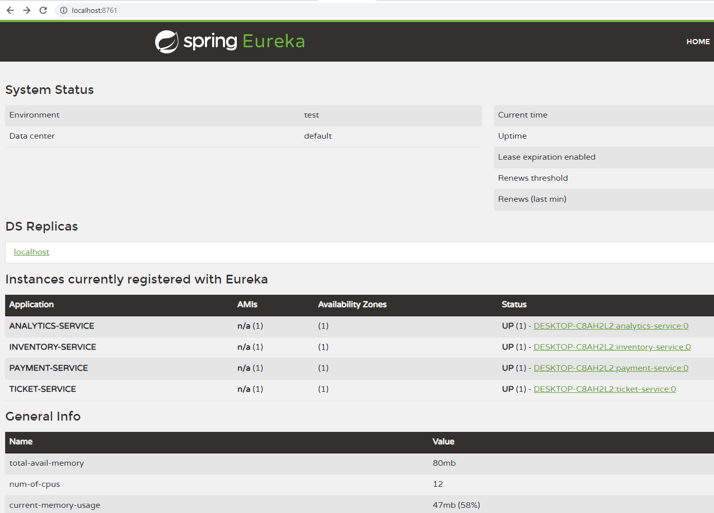

# Configuração do projeto - Spring Boot & Cloud (Work In Progress)

Este projeto foi desenvolvido utilizando as IDE's: Intellij e VSCode. 
Cada micro serviço foi criado como um módulo de um projeto no Intellij.

Seguir padrões existentes favorece o desenvolvimento de um projeto. Um dos
ganhos é que em geral esses padrões são exaustivamente usados e testados,
portanto bastante validados. Entretanto é necessário compreender quais são
os tradeoffs desses padrões, quando utilizá-los, comos eles funcionam, etc.

Este projeto se basea em um autor bastante conhecido e conceituado quando se
fala de micro serviços: [Padrões de Micro serviços - Chris Richardson](https://microservices.io/patterns/microservices.html)


## Porta de acesso para os micro serviços

Disponibilizar o acesso direto aos micro serviços pode ser uma tarefa árdua.
Um cenário onde se tem diversas instâncias de um mesmo serviço e onde cada instância 
possivelmente terá um IP dinâmico é bastante desafiador.
Para isso existe um padrão conhecido como `API Gateway`.
Através dele é possível acessar todos os serviços através de um único endereço conhecido.
Basicamente o `API Gateway` redireciona o tráfego para os serviços existentes. Na stack
do `Spring Cloud` é disponibilizada a dependência `Spring Cloud Gateway` que implementa esse padrão.

E como o `API Gateway` consegue encontrar os serviços corretamente?

Existem dois outros padrões conhecidos como `Service Registry` e `Service Discovery`. 
Basicamente o primeiro registra cada serviço em um "banco de dados", lá são adicionadas
informações de quais instâncias existem e quais suas localizações. Em geral é disponibilizado
também um serviço de checagem da "saúde" das API's, um `healt check API` que é um outro padrão
de micro serviços.

O Spring Cloud disponibiliza o `Service Registry` para o projeto através da inclusão da dependência abaixo:   

```implementation 'org.springframework.cloud:spring-cloud-starter-netflix-eureka-server'```

Através da annotation `@EnableEurekaServer` e de configurações apropriadas no arquivo `properties.yml` 
é possível habilitar o `Service Registry`.

`GatewayServiceApplication.java`
````java
@EnableEurekaServer
@SpringBootApplication
public class GatewayServiceApplication() {
    public static void main(String[] args) {
        SpringApplication.run(GatewayServiceApplication.class, args);
    }
}
````
`properties.yml`

```properties
server:
  port: 8761
eureka:
  client:
    registerWithEureka: false
    fetchRegistry: false

```


É possível acessar o painel de propriedades do Spring Eureka através do
do endereço http://localhost:8761. Ver imagem abaixo. Obs: É necessário ter algum serviço
inscrito para visualizá-los no painel de propriedades.




Como os registros referente aos serviços já existem através do `Service Registry` é 
necessário ter um ponto central de acesso a cada um deles no `API Gateway`, ou seja
é necessário definir uma espécie de "roteador" que executa as requisições para cada
serviço de forma correta. Este padrão é conhecido como `Service Discovery`. O "roteador",
ou `router`, faz uma consulta um `Service Registry` e redireciona as requisições de
acordo com cada serviço. Em documentações futuras mais detalhes sobre esse padrão serão
mostrados na prática.

Mais detalhes sobre os padrões em: 
- [API Gateway](https://microservices.io/patterns/apigateway.html)
- [Service registry](https://microservices.io/patterns/service-registry.html)
- [Service Discovery](https://microservices.io/patterns/server-side-discovery.html)
- [Health Check API](https://microservices.io/patterns/observability/health-check-api.html)